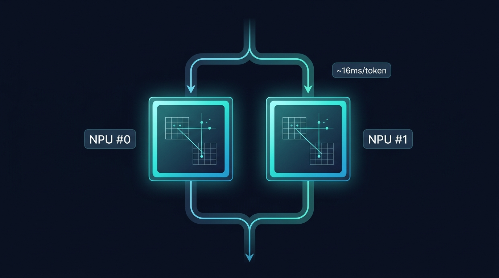

# RKNN Matmul Decoder

<p align="center">
  
</p>

<p align="center">
  <strong>Open-source transformer decoder for Rockchip NPU — replace RKLLM with full transparency.</strong>
</p>

<p align="center">
  <a href="https://opensource.org/licenses/MIT"></a>
  <a href="https://github.com/topics/rk3588"></a>
  <a href="https://github.com/airockchip/rknn-llm"></a>
</p>

Run transformer decoders on Rockchip NPU with full source code, conflict-free RKNN coexistence, and per-step profiling.

## Why This Exists

Rockchip's RKLLM is fast but closed-source, and **conflicts with RKNN models** when running ASR + TTS simultaneously:

| Aspect | RKLLM | This Project |
|--------|-------|--------------|
| **Performance** | 43 ms/token | 82 ms/token (1.9×) |
| **Open source** | ❌ Closed `librkllmrt.so` | ✅ Full C code |
| **RKNN coexistence** | ❌ IOMMU domain conflict | ✅ Domain isolation |
| **Custom ops** | ❌ Black box | ✅ Full control |
| **Profiling** | ❌ No visibility | ✅ Per-component timing |
| **Debuggability** | ❌ Opaque | ✅ Regression test suite |

**Root causes RKLLM conflicts:**
1. **IOMMU domain contention** — RKLLM and RKNN share domain 0's 4GB address space
2. **NPU handle limit** — `/dev/rknpu` caps at ~1020 DMA handles per process

This library solves both: `iommu_domain_id=1` for isolation, context pooling for handle efficiency.

## Performance

### Measured on RK3576 (Qwen3-ASR-0.6B, 28 layers, d=1024)

| Configuration | ms/token | Breakdown |
|---------------|----------|-----------|
| **INT4 + NPU lm_head** | **82** | matmul 34 + rebind 24 + lm_head 19 + cpu 4 |
| FP16 + NPU lm_head | 252 | matmul 88 + rebind 90 + lm_head 69 + cpu 4 |
| FP16 + CPU lm_head | 280 | matmul 85 + rebind 69 + lm_head 103 + cpu 3 |
| FP16 naive (v1) | 461 | no NEON, no NPU lm_head |
| RKLLM W4A16 (closed) | 43 | compiled NPU graph |

### Optimization Journey (461ms → 82ms)

| Optimization | ms/token | Improvement |
|-------------|----------|-------------|
| Baseline (naive CPU lm_head) | 461 | — |
| + NEON GEMV | 335 | -27% |
| + Destroy fix + stable pool | 280 | -16% |
| + W4A16 quantization | 167 | -40% |
| + NPU tiled lm_head (FP16) | 125 | -25% |
| + NPU lm_head INT4 | **82** | **-34%** |

### Why 82ms vs RKLLM 43ms?

RKLLM compiles the entire 28-layer transformer into **one fused NPU graph** with SRAM caching. Our library uses the matmul API with per-operation dispatch:
- 196 individual `rknn_matmul_run` calls (vs 1 fused graph)
- CPU-side attention, RoPE, RMSNorm (vs fused NPU ops)
- B weight rebinding overhead (vs pre-loaded weights)

The 1.9× gap is architectural, not algorithmic.

### Per-Component Profile (INT4, last step)

```
total:    82.0 ms
├─ matmul (NPU):  34.4 ms  (42%)  ← 28 layers × 7 INT4 projections
├─ rebind:        23.6 ms  (29%)  ← 234 rknn_matmul_set_io_mem calls
├─ lm_head (NPU): 18.7 ms  (23%)  ← 38 tiles × (1024,4096) INT4
├─ cpu_ops:        4.0 ms  ( 5%)  ← RMSNorm + RoPE + attention + SiLU
└─ convert:        1.1 ms  ( 1%)  ← FP16↔FP32
```

## Features

- **IOMMU domain isolation** — runs on separate domain from RKNN models, zero conflict
- **Context pooling** — 28-layer decoder uses only ~211 NPU handles (vs 784 naive)
- **NPU-tiled lm_head** — 151936-vocab projection on NPU via INT4 tiles (103ms → 19ms)
- **Per-step profiling** — `decoder.stats` returns matmul_ms, rebind_ms, lm_head_ms, cpu_ops_ms
- **Complete decoder stack**: KV cache, RoPE (interleaved + split-half), RMSNorm, GQA attention, FFN, sampling
- **Multi lm_head support**: multiple output heads per step (e.g., Code Predictor with 15 heads)
- **W4A16 per-column quantization** with NEON-fused scale application
- **NEON-optimized CPU operators** and FP16 GEMV
- **Python bindings** via pybind11
- **Regression test suite** with numpy reference (cosine=0.999999)

## Real-World Usage

### Qwen3-ASR — 52-language streaming ASR

```
Encoder:  RKNN FP16 merged      → 431ms / 4s chunk
Decoder:  This library (INT4)   → 82ms/token, 28 layers
LM head:  NPU INT4 tiled        → 19ms (151936 vocab)
End-to-end RTF: ~0.5
```

### Qwen3-TTS Code Predictor — Autoregressive codec generation

```
Decoder:  This library (W4A16)  → 5 layers, 15 autoregressive steps
LM heads: 15 × vocab=2048       → matmul_decoder_step_head()
Per-step: ~6ms
```

### Matcha-TTS — Non-autoregressive acoustic model

```
Matcha:   RKNN FP16             → 470ms
Vocos:    RKNN FP16             → 250ms
ISTFT:    CPU                   → 190ms
Total:    1.76s, RTF 0.054
```

*Matcha and Vocos run as RKNN models on domain 0, this library's decoder runs on domain 1 — no conflict.*

## Quick Start

### Python

```python
import matmul_decoder as md
import numpy as np

# Create decoder (auto-selects pool mode and NPU lm_head)
decoder = md.MatmulDecoder(
    model_dir="/path/to/weights",
    max_seq_len=4096,
    quant_type="int4",       # "fp16" or "int4"
    exec_mode="single_core"  # "single_core" or "dual_core"
)

# Run one step
logits = decoder.step(token_id=151644)  # returns numpy array [vocab_size]
predicted = np.argmax(logits)

# Per-step profiling
stats = decoder.stats
print(f"total={stats['total_ms']:.1f}ms, matmul={stats['matmul_ms']:.1f}ms, "
      f"lm_head={stats['lm_head_ms']:.1f}ms")
```

### C API

```c
#include "matmul_decoder.h"

MatmulDecoderConfig config = matmul_decoder_config_qwen3_0_6b();
MatmulDecoderContext* ctx = matmul_decoder_create(
    "/path/to/weights", &config, QUANT_INT4, 4096);

float logits[151936];
int token = matmul_decoder_step(ctx, 151644, NULL, logits);

MatmulDecoderStats stats;
matmul_decoder_get_stats(ctx, &stats);
printf("total=%.1fms matmul=%.1fms lm_head=%.1fms\n",
       stats.total_ms, stats.matmul_ms, stats.lm_head_ms);

matmul_decoder_destroy(ctx);
```

## Installation

```bash
# Prerequisites: RKNN SDK (RKNPU2 runtime), GCC, Python 3.9+

export RKNN_SDK_PATH=/path/to/rknn-toolkit2/rknpu2/runtime/Linux
make python  # builds C library + Python binding
```

## Model Adaptation

This is a **model-agnostic** decoder. To adapt a new model:

1. Export weights:
   ```
   model_dir/
   ├── config.json
   ├── embeddings.bin          # [vocab_size, hidden_dim] FP32
   ├── final_norm.bin          # [hidden_dim] FP32
   └── layers/
       ├── layer_00/
       │   ├── q_proj.bin      # FP16 (or q_proj_weight.bin + q_proj_scales.bin for INT4)
       │   ├── k_proj.bin
       │   ├── v_proj.bin
       │   ├── o_proj.bin
       │   ├── gate_proj.bin
       │   ├── up_proj.bin
       │   ├── down_proj.bin
       │   ├── input_norm.bin  # FP32
       │   ├── post_attn_norm.bin
       │   ├── q_norm.bin      # Optional (QK norm)
       │   └── k_norm.bin
       └── ...
   ```

2. Create config:
   ```c
   MatmulDecoderConfig config = {
       .hidden_dim = 1024, .num_layers = 28,
       .num_q_heads = 16, .num_kv_heads = 8, .head_dim = 128,
       .ffn_dim = 3072, .vocab_size = 151936,
       .rope_theta = 1000000.0f,
       .has_qk_norm = 1,
       .rope_style = 0,           // 0=interleaved (Qwen/LLaMA), 1=split-half (GPT-NeoX)
       .iommu_domain_id = 1,      // Separate from RKNN models
       .context_pool_mode = 0,    // Auto
   };
   ```

## Configuration Guide

### Context Pool Mode

| Mode | Value | NPU Handles | B Rebind | Best For |
|------|-------|-------------|----------|----------|
| **Auto** | `0` | adaptive | adaptive | Default — pools for ≥16 layers |
| **Pool** | `1` | ~211 (28L) | Yes | Running alongside RKNN models |
| **Dedicated** | `2` | ~784 (28L) | **No** | Small models (≤16 layers) |

### Quantization

| Type | Weight Size | Speed | Accuracy |
|------|------------|-------|----------|
| FP16 | 100% | 252 ms/token | Best (cosine=1.0) |
| **W4A16** | **25%** | **82 ms/token** | Good (cosine>0.998) |

### RoPE Style

| Style | Value | Models |
|-------|-------|--------|
| Interleaved | `0` | Qwen3, LLaMA, Mistral (default) |
| Split-half | `1` | GPT-NeoX, ChatGLM |

## Testing & Benchmarking

```bash
# Generate numpy reference (one-time, runs on device)
python3 tests/generate_reference.py --model-dir /path/to/weights

# Regression test (verifies correctness after code changes)
python3 tests/test_regression.py --model-dir /path/to/weights
# Output: cosine similarity, top-1 match, top-5 overlap

# Performance benchmark
python3 tests/benchmark.py --model-dir /path/to/weights --quant-type int4
# Output: ms/token table with load time, avg, p50, p99
```

## Architecture

```
┌─────────────────────────────────────────────────┐
│  Python: matmul_decoder.step(token_id)          │
├─────────────────────────────────────────────────┤
│  pybind11 C++ wrapper                           │
├─────────────────────────────────────────────────┤
│  matmul_decoder.c                               │
│    ├─ Context pool (5 shared NPU contexts)      │
│    ├─ Per-layer: rebind B → matmul_run (NPU)    │
│    ├─ CPU ops: RMSNorm, RoPE, GQA attention     │
│    ├─ NPU tiled lm_head (38 × INT4 tiles)       │
│    └─ Per-step profiling (clock_gettime)        │
├─────────────────────────────────────────────────┤
│  RKNN Matmul API (librknnrt.so)                 │
│    ├─ rknn_matmul_create / run / destroy        │
│    ├─ IOMMU domain isolation                    │
│    └─ FP16×FP16→FP32 / FP16×INT4→FP16          │
└─────────────────────────────────────────────────┘
```

## Supported Platforms

| SoC | NPU Cores | Status | Notes |
|-----|-----------|--------|-------|
| RK3576 | 2 | Tested (82ms/token) | Primary development platform |
| RK3588 | 3 | Compatible | Expected faster (more NPU cores) |

## Known Limitations

- **B rebind overhead**: Context pooling requires rebinding B weights per matmul (24ms/token for 28 layers). This is an RKNN matmul API limitation.
- **IOMMU memory budget**: ~211 DMA handles for 28 layers + 38 lm_head tiles. QKV merge (combining 3 projections into 1) exceeds budget on 8GB devices.
- **INT4 lm_head precision**: Per-column INT4 quantization of the 151936-vocab projection causes minor rank changes in top-1 predictions (cosine>0.998, top-5 overlap maintained).

## License

MIT License.

## Acknowledgments

- Inspired by [qwen3asr_rk](https://github.com/qzxyz/qwen3asr_rk) for ASR decoder integration
- Architecture informed by Rockchip's [rknn-llm](https://github.com/airockchip/rknn-llm)
